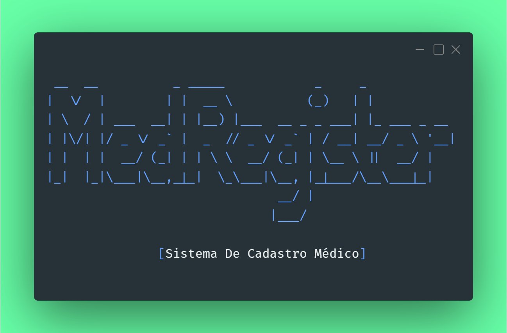

<div id="top" align="center">
  <div id="top" align="center">

<p align="center"></p>

Bem-vindo ao **MedRegister**, seu Sistema de Cadastro Hospitalar em Java! 
Este projeto foi desenvolvido para  oferecer uma solução de gerenciamento 
eficiente para informações de  funcionários e pacientes em um ambiente hospitalar. 👨‍💻 <br>

Redes sociais

Paulo Victor: <a href="https://www.linkedin.com/in/paulopbi/" target="_blank">Linkedin</a> •
            <a href="https://github.com/paulopbi" target="_blank">Github</a>
| Gabriel: <a href="linkedin.com/in/gabriel-fagundes-a54a82251/" target="_blank">Linkedin</a> •
        <a href="https://github.com/gabrafo" target="_blank">Github</a> 

  </div>
</div>

## Recursos Principais

- Cadastro por Linha de Comando (CLI): Utilize uma interface de linha de comando intuitiva para 
realizar operações CRUD (Criar, Ler, Atualizar, Excluir) de maneira rápida e eficaz.

- Gerenciamento de Funcionários e Pacientes: O sistema permite o cadastro detalhado de funcionários e pacientes, 
proporcionando uma visão abrangente do pessoal e dos atendimentos no hospital.

## Como Começar
Siga os passos abaixo para começar a utilizar o sistema:

1. Clone o Repositório:

```bash
git clone https://github.com/paulopbi/medregister
```

2. Navegue até o Diretório do Projeto:

```bash
cd medregister
```
3. Compile e Execute o Projeto:

```bash
javac src/application/Main.java 
java src/application/Main.java

```

## Contribuição
Sua contribuição é bem-vinda! Sinta-se à vontade para sugerir melhorias, relatar problemas ou enviar pull requests.

Divirta-se utilizando o MedRegister, seu Sistema de Cadastro Hospitalar em Java!

